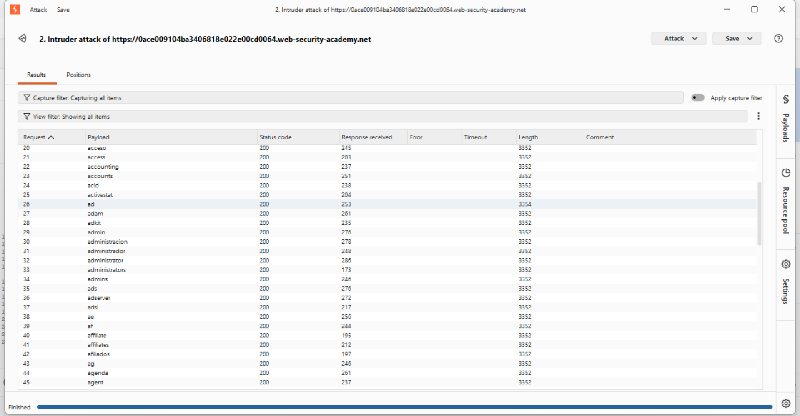
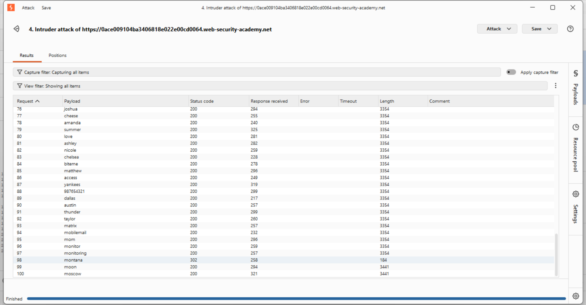
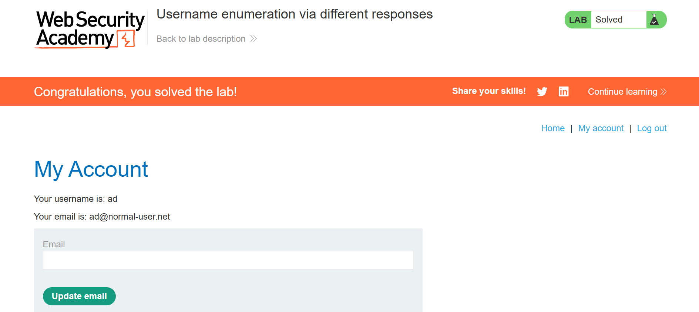

# Lab: Username Enumeration via Different Responses

## 🎯 Objective
Identify valid credentials for a target user by exploiting inconsistencies in server error messages.

---

## 🛠️ Tooling & Fundamental Concepts
* **Burp Proxy (Interceptor)**: Acts as a "Man-in-the-Middle" between the browser and the server. I used this to capture the raw login request structure before sending it to Intruder. 
* **Burp Intruder**: An automation tool used for "Machine Gun" style attacks. It takes a template request and swaps out specific markers with entries from a wordlist.
* **Brute Force (Dictionary Attack)**: A trial-and-error method using a pre-defined list of likely strings (wordlist) rather than every possible character combination to "guess" credentials.
* **Response Length Analysis**: A technique used to identify valid data by monitoring byte-count anomalies in HTTP responses.
* **HTTP 302**: A redirect status code. In authentication labs, this is a "Success Signal" indicating the server accepted the credentials and is redirecting to the account dashboard.

---

## 🚀 Execution Process

### Step 1: Request Interception
I used the **Burp Interceptor** to catch a raw login attempt. This allowed me to see the exact POST parameters (`username=` and `password=`) so I could tell Intruder exactly where to inject the wordlists.

### Step 2: Username Discovery (Enumeration)
I sent the captured request to **Intruder** to perform a dictionary-based brute force on the `username` field.
* **Position**: `username=§invalid-user§&password=invalid-password`
* **Observation**: Most requests returned a length of **3352 bytes**.
* **Anomaly**: The username `ad` returned **3354 bytes**.
* **Logic**: The 2-byte difference proves the server handles a "valid user" differently than an "invalid user," effectively leaking that `ad` exists in the database.

### Step 3: Password Exploitation
With the valid username `ad` confirmed, I pivoted to brute-forcing the password.
* **Position**: `username=ad&password=§invalid-password§`
* **Success Signal**: While most attempts returned a `200 OK` (failed login), the payload `montana` triggered an **HTTP 302**.
* **Result**: The 302 redirect confirms the server accepted the credentials.

---

## 🖼️ Evidence
- **Username Anomaly Identified (Length 3354):**

- **Password Found (HTTP 302 Redirect):**

- **Lab Solved:**
