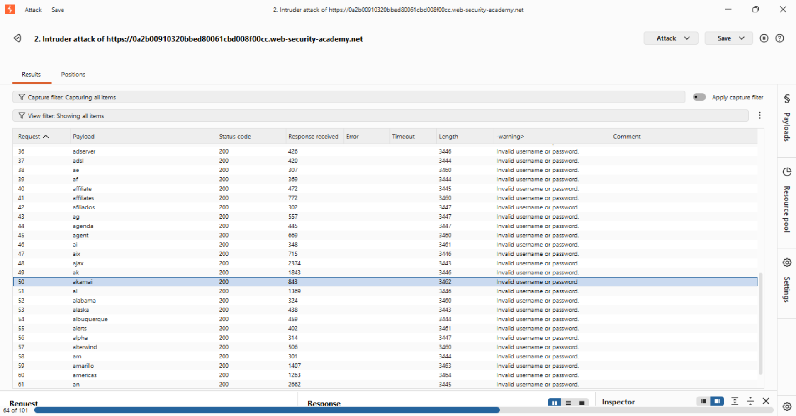
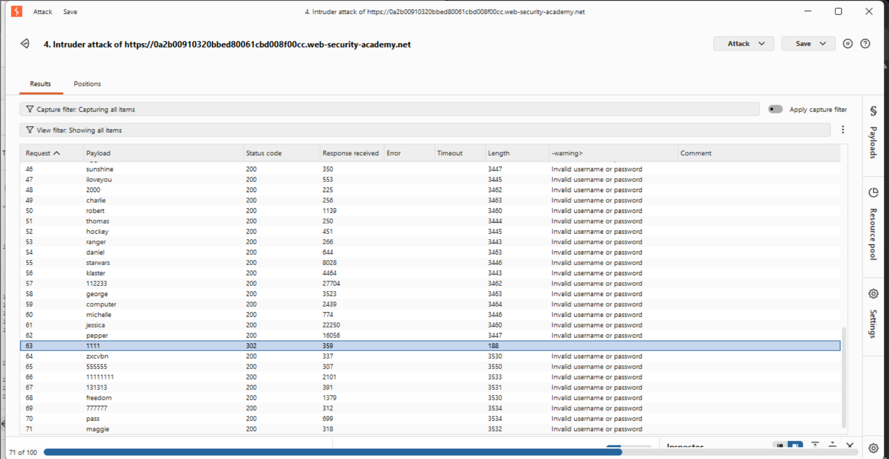
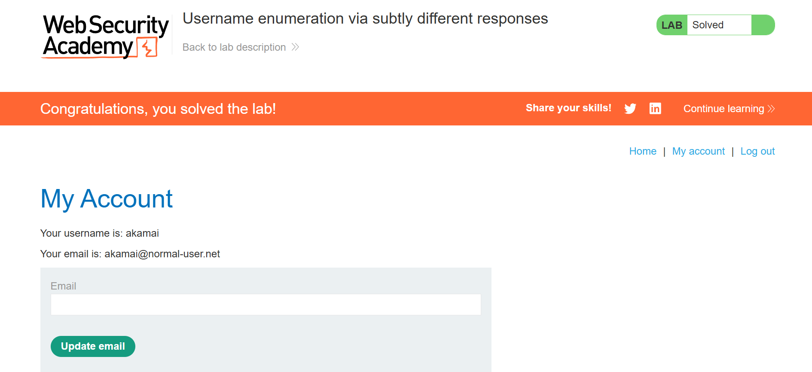

# Lab: Username Enumeration via Subtly Different Responses

## 🎯 Objective
Identify valid credentials when the server returns near-identical responses for both valid and invalid users.

---

## 🛠️ Tooling & Fundamental Concepts
* **Grep - Extract**: A Burp Intruder tool used to "zoom in" on a specific piece of text in a response. This allows us to spot tiny differences (like a missing period or extra space) that don't affect the overall byte length.
* **Side-Channel Analysis**: Finding leaks in information that aren't obvious (like response timing or invisible text changes).
* **HTTP 302**: Confirmed successful login and redirection.

---

## 🚀 Execution Process

### Step 1: Identifying the Subtle Leak
I ran an Intruder attack on the username field. The lengths were almost identical, making standard analysis impossible. 
* **The Solution**: I configured **Grep - Extract** to pull the exact error message string from the response.
* **The Discovery**: While most users returned "Invalid username or password.", the valid username `akamai` returned "Invalid username or password" (missing the trailing period). 
* **Why this happened**: The developer likely used two different code blocks for error handling, and one was missing a single character.

### Step 2: Password Brute Force
I locked the username to `akamai` and targeted the password field.
* **Success Signal**: Payload `1111` triggered a **Status Code 302**.
* **Length Change**: The response length dropped from ~3400 to **188 bytes**, confirming the server is no longer sending the login page but a redirect header.

---

## 🖼️ Evidence
- **Subtle Text Difference Found (Grep-Extract):**

- **Successful Password Redirect (302 Found):**

- **Lab Solved:**
