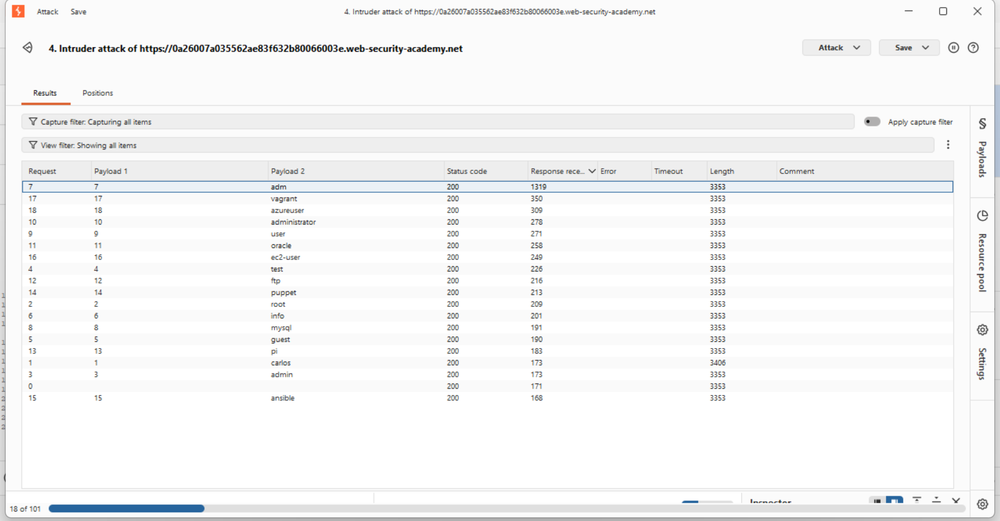
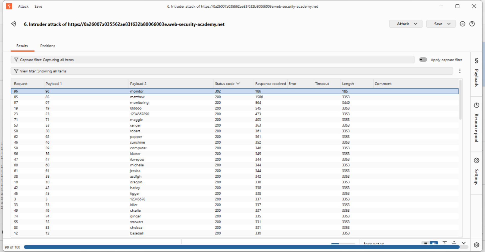
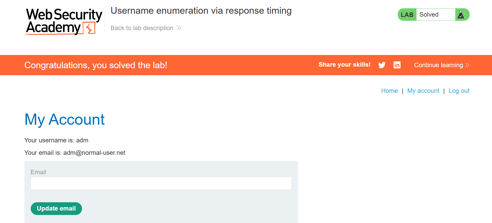

# Lab: Username Enumeration via Response Timing

## Overview
Exploited a **Side-Channel Timing Attack** to identify a valid username and brute-force the password while bypassing rate-limiting protections.

## Core Technical Components

### 1. X-Forwarded-For Header (IP Spoofing)
- **Purpose**: Bypass IP-based rate limiting.
- **Mechanism**: Added `X-Forwarded-For: §1§`. By injecting a unique number for every request, the server treats each attempt as coming from a different source, preventing the account/IP lockout.

### 2. Attack Type: Pitchfork
- **Purpose**: Simultaneous payload synchronization.
- **Mechanism**: Used to link a unique IP (Payload 1) to each username/password guess (Payload 2).
- **Why**: Ensures that every single login attempt is paired with a fresh "spoofed" IP address.

### 3. Response Timing (The Side-Channel)
- **Purpose**: Identify the correct username without an explicit "User Found" message.
- **Mechanism**: Used a massive password string to force the server to hash it.
    - **Invalid User**: Server rejects the name immediately (~200ms).
    - **Valid User**: Server hashes the long password before rejecting, causing a noticeable delay.
- **The Outlier**: A response time of **1319ms** confirmed `adm` as the valid user.

### 4. Resource Pool Configuration
- **Setting**: Maximum concurrent requests = `1`.
- **Why**: Essential for the timing phase. If multiple requests run at once, network jitter and server load can create "fake" delays. Running them one-by-one ensures the 1319ms delay is purely from the hashing algorithm.

## Final Execution
- **Target User**: `adm`
- **Target Password**: `monitor`
- **Success Indicator**: Received an HTTP `302 Found` status code, indicating a successful login redirect.

## 🖼️ Evidence
- **Successful Username:**

- **Successful Password Redirect (302 Found):**

- **Lab Solved:**
