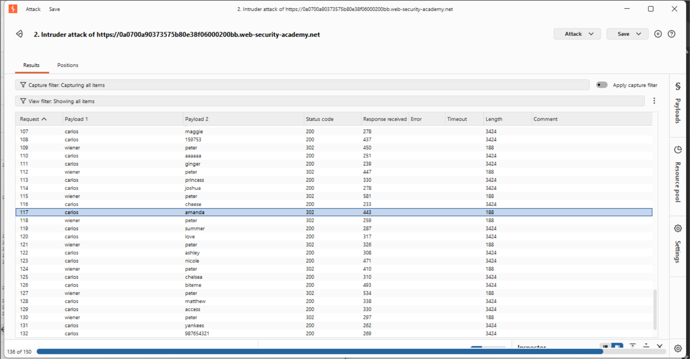
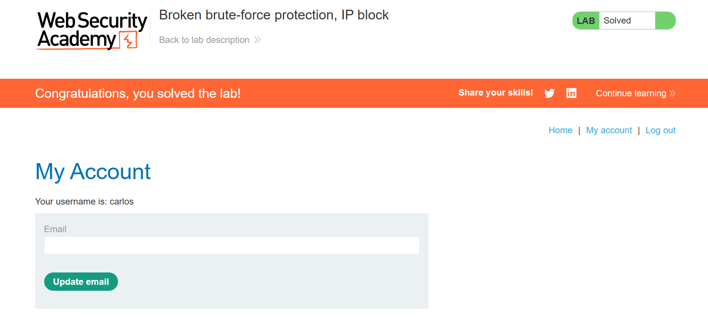

# Lab: Broken Brute-Force Protection, IP Block

## Overview
This lab exploited a **Logic Flaw** in the server's rate-limiting mechanism. The protection was based on a "failure counter" that incorrectly resets to zero upon any single successful login, allowing for an infinite brute-force attack via interleaving.

## The Strategy: "Reputation Reset"
Instead of trying to hide the IP (which failed because the server tracks the session/account state), I manipulated the server's internal logic:
- **Pattern**: `carlos` (Fail) -> `carlos` (Fail) -> `wiener` (Success/Reset).
- **The Result**: The counter never reached the threshold of 3, so the 1-minute IP block was never triggered.

## Key Configurations

### 1. Attack Type: Pitchfork
- **Requirement**: Perfectly synchronized payloads.
- **Set 1 (Usernames)**: `carlos, carlos, wiener...`
- **Set 2 (Passwords)**: `pass1, pass2, peter...`
- **Logic**: Pitchfork ensures that `wiener` is always paired with the correct password `peter` to trigger the reset.

### 2. Resource Pool: Maximum Concurrent Requests = 1
- **Criticality**: This attack is **stateful**. 
- **Reasoning**: If Burp sends requests in parallel, the `wiener` (Reset) request might reach the server *before* the `carlos` (Fail) requests. Serial execution (one-by-one) ensures the `Reset` always follows two `Fails` in the exact order required by the logic flaw.

## Data Management & Workflow Efficiency
While solving this lab, I utilized VS Code to manage and verify the payload sets before importing them into Burp Suite. This methodology was critical for:

- **Scalability & Precision**: Managing 150+ lines of raw data. Using a code editor allowed for immediate verification of line counts (ensuring the lists were identical in length), which is essential for the "Pitchfork" attack to remain perfectly aligned across Payload Sets 1 and 2.
- **Workflow Mastery**: Leveraging VS Code's technical environment to avoid "Smart Quotes" or "Auto-Capitalization" (common in Word) that would have corrupted the case-sensitive passwords and failed the attack.
- **Verification**: The ability to quickly scroll and check the "interleaving" pattern (Carlos, Carlos, Wiener) before committing to the 5-minute Intruder attack.

## Final Discovery
- **Target Account**: `carlos`
- **Cracked Password**: `amanda`
- **Status**: HTTP `302 Found` (Successful Login)

## Evidence & Verification

### 1. Intruder Attack Log
The image below shows the successful bypass. Note that every 3rd request is a successful login for `wiener`, which resets the failure counter, eventually allowing the `302 Found` response for `carlos` on request 117.

### 2. Final Account Access
Successful login confirmation as `carlos`.

