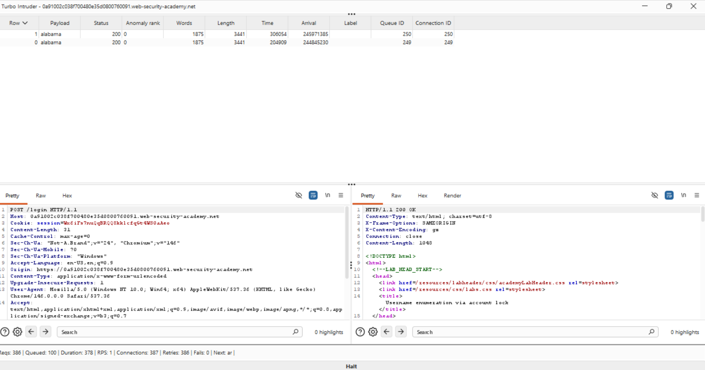
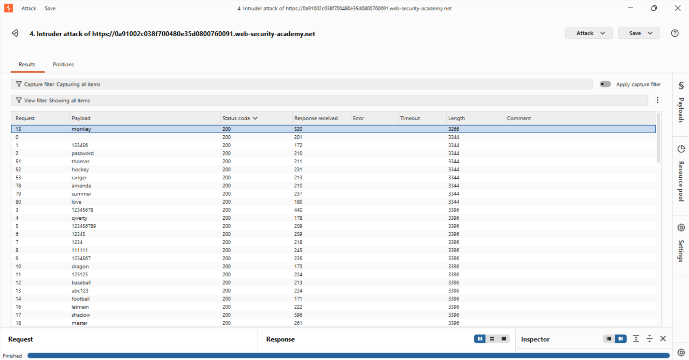
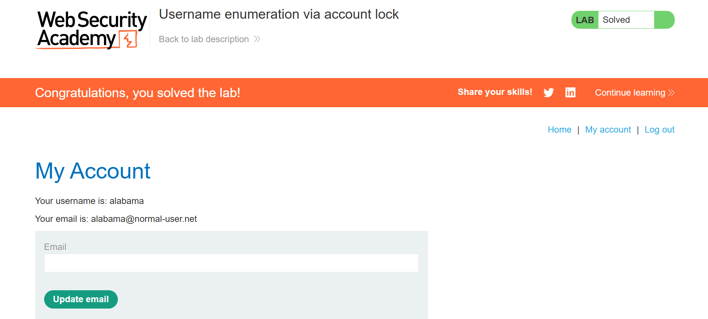

# Lab Writeup: Username Enumeration via Account Lockout (Bypassing Intruder Throttling)

## 📌 Executive Summary
This lab demonstrates an authentication vulnerability where valid usernames can be enumerated because the application enforces an account lockout state after 5 consecutive failed login attempts. However, standard automation tools (like Burp Suite Community Edition) introduce artificial request throttling, causing the server's rolling 60-second lockout window to reset before the 5 strikes can be delivered.

To bypass this tooling constraint, I discarded standard UI-driven workflows and engineered a highly customized script utilizing **Turbo Intruder** to achieve raw throughput control and precise request nesting.

---

## 🛠️ Technical Hurdles & Engineering Pivots

### 1. The Multi-Row Timing Trap
* **Initial Strategy:** Iterating through all 100 usernames sequentially across 5 separate flights.
* **The Flaw:** `Flight 1 -> User 100` took more than 60 seconds to process due to network constraints. By the time `Flight 2` cycled back to `User 1`, the backend failure window had cleared out to zero.
* **The Pivot:** Inverted the application logic loops within the script. Instead of cycling through the entire wordlist row-by-row, the script was refactored to focus on **one single username** and deliver 5 rapid, sequential payloads back-to-back before advancing to the next target.

### 2. High-Speed Dropped Connections
* **The Problem:** Flooding the server with concurrent connections resulted in network dropouts (`Status Code 0`), failing to record consecutive strikes reliably.
* **The Pivot:** Reconfigured the engine down to a single concurrent line (`concurrentConnections=1`), maintaining perfect chronological delivery order while staying well within the server's time limits.

---

## 💻 The Solution: Optimized Turbo Intruder Script

```python
def queueRequests(target, wordlists):
    # Enforcing 1 connection to prevent network drops while maintaining raw pipeline speed
    engine = RequestEngine(endpoint=target.endpoint,
                           concurrentConnections=1,
                           requestsPerConnection=10,
                           pipeline=False
                           )

    usernames = ['carlos', 'root', 'admin', 'alabama', 'autodiscover'] # Truncated list

    # NESTED LOOP: Inverting the flight path to land 5 hits on a single user instantly
    for username in usernames:
        for flight in range(5):
            engine.queue(target.req, username)

def handleResponse(req, interesting):
    # Isolating anomalous response lengths to filter out background noise
    if req.length != 3389:
        table.add(req)
```
---
## 🎯 Exploit Execution & Results
* **Username Discovery:** Running the inverted script above instantly isolated the account alabama with a unique response payload size of 3441 (Account Lockout State triggered).

* **Password Bruteforce:** After waiting 60 seconds for the lockout timer to clear, a targeted sniper attack was launched against alabama using the candidate password array.

* **The Compromise:** Request #15 with payload monkey returned a status code update and a distinct byte length of 3266, indicating a successful application authentication redirect.

## 📷 Evidence & Artifacts

### Username Enumeration Discovery


### Successful Password Bruteforce


### Status: LAB SOLVED 🚀
