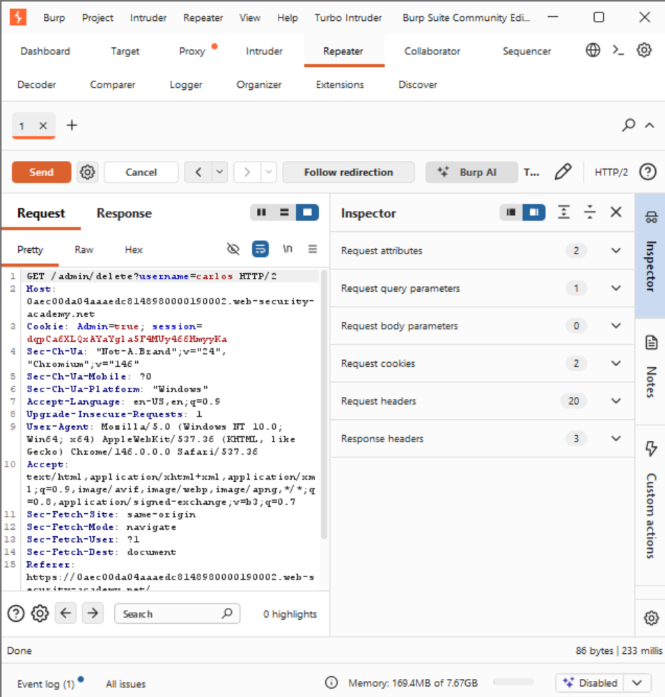
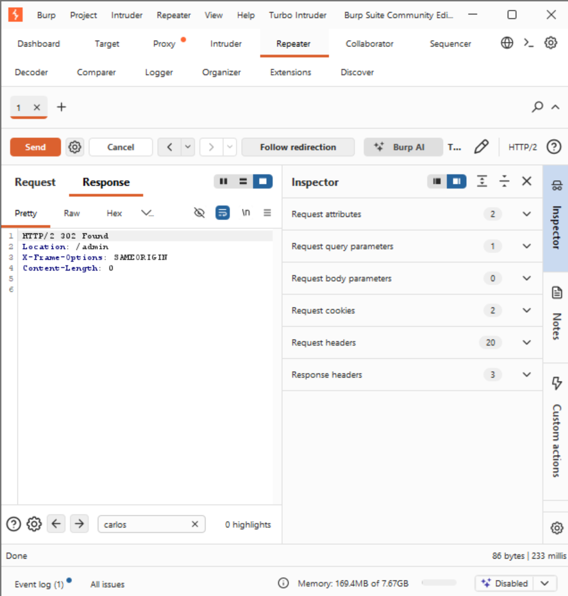

# Lab: User Role Controlled by Request Parameter

## 📌 Vulnerability Profile

* **Vulnerability Type:** Broken Access Control / Vertical Privilege Escalation
* **Severity:** High
* **Flaw:** The application backend trusts client-controlled parameters inside the HTTP headers (specifically within cookies) to determine authorization levels, rather than verifying the session data strictly server-side.

---

## 🕵️ Reconnaissance & Analysis

1. Logged into the application using the standard provided credentials (wiener:peter).
2. Navigated to the `/my-account` page and analyzed the traffic inside the Burp Suite proxy history string context.
3. Spotted a highly interesting parameter pair inside the request headers:

Backtickshttp
Cookie: Admin=false; session=dqpCa6L...
Backticks

4. **Hypothesis:** The backend uses the explicit boolean string state `Admin=false` to check if a user is allowed to access privileged console paths.

---

## 🛠️ Exploitation & Execution Flow

### Step 1: Privilege Spoofing

* Sent the profile request to **Burp Repeater**.
* Mutated the value string parameter of the cookie from `Admin=false` to `Admin=true`.

The server accepted the falsified state parameter and successfully returned a link pointing to the hidden `/admin` panel inside the HTML response page body.

### Step 2: Administrative Deletion Payload

* Modified the path endpoint request parameter on Line 1 from `/my-account?id=wiener` to target the administrative panel console path: `/admin`.
* Identified the localized deletion endpoint parameter string mapping for the targeted user account (`carlos`).
* Sent the finalized destructive action payload to execute the horizontal user deletion string account wipe:

Backtickshttp
GET /admin/delete?username=carlos HTTP/2
Host: web-security-academy.net
Cookie: Admin=true; session=dqpCa6L...
Backticks

---

## 📸 Proof of Concept (PoC)

### Request Routing Mapping:

### Server Execution Confirmation:
The server returned a `302 Found` status code string, handling the structural deletion authorization perfectly and redirecting back upstream cleanly:

---

## 💡 Live Hunting Key Takeaway

Whenever you trace cookie data blocks or hidden POST payload arrays, look out for explicit parameters checking user permissions directly (`role=user`, `isAdmin=0`, `privilege=customer`). If you can manipulate those variables before sending the request out from Burp, the backend server script logic might instantly treat you like an administrator.