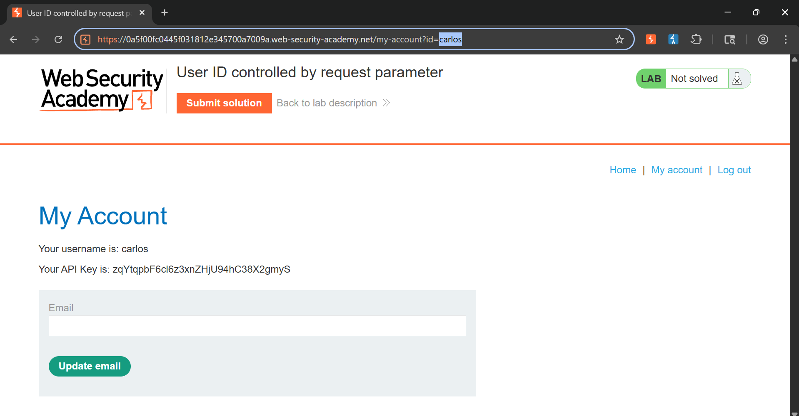
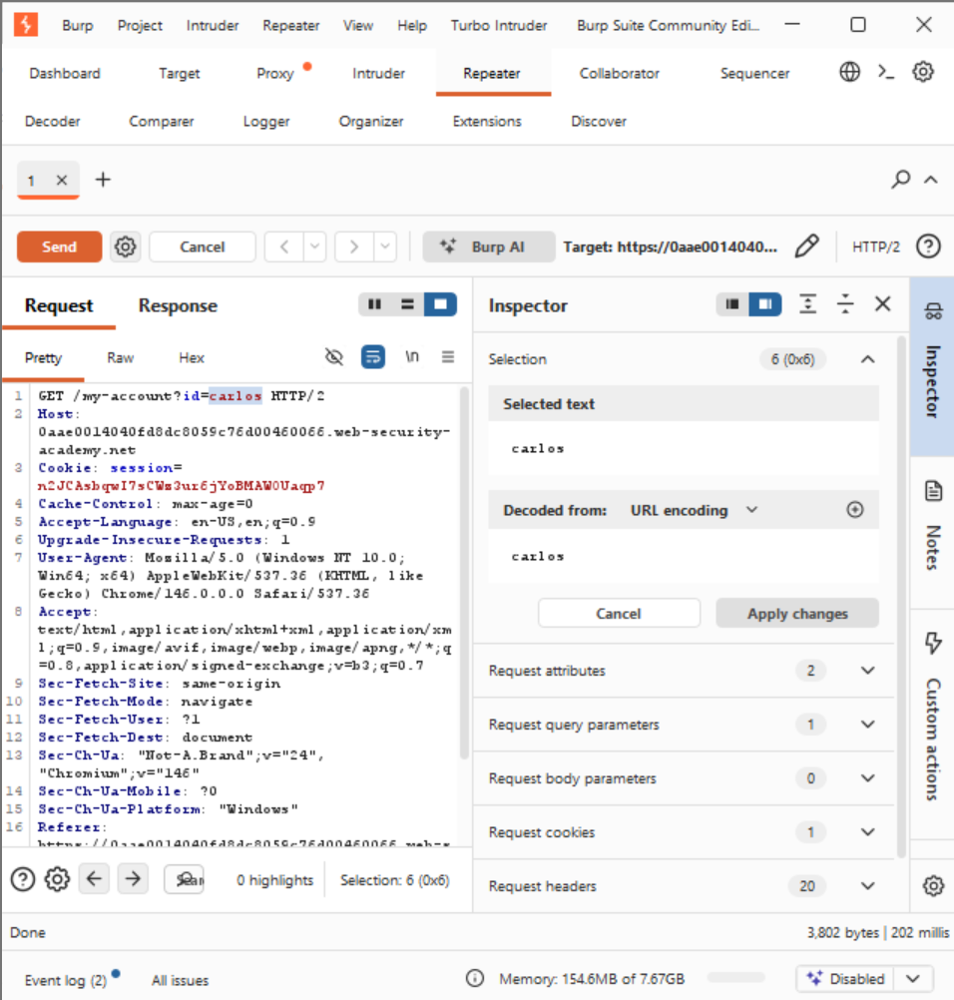
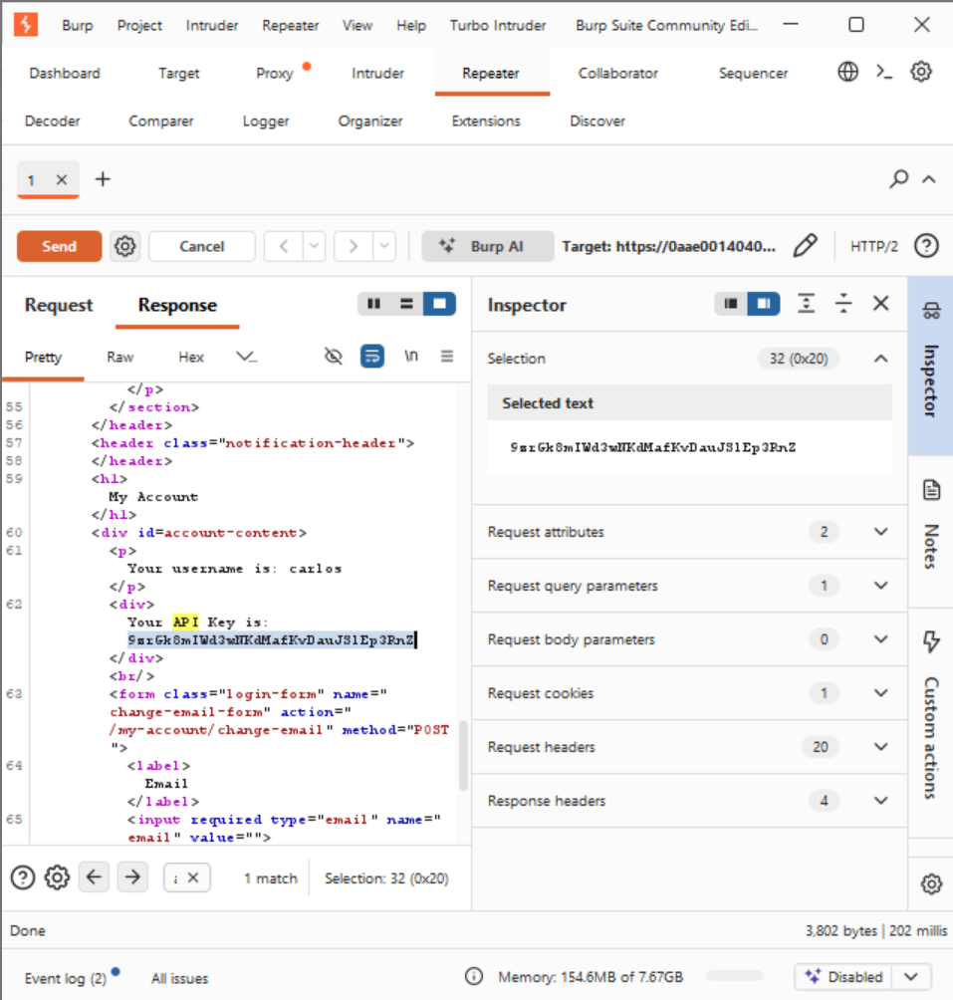

# Lab: User ID Controlled by Request Parameter

## 📌 Vulnerability Profile
* **Vulnerability Type:** Insecure Direct Object Reference (IDOR) / Horizontal Privilege Escalation
* **Severity:** High
* **Flaw:** The server-side code handles authentication (verifying if a user is logged in) but fails to implement strict authorization checks to ensure the logged-in session owns the requested resource ID parameter.

---

## 🕵️ Reconnaissance & Analysis
1. Authenticated as standard user `wiener`.
2. Analyzed the profile dashboard loading mechanics inside Burp Suite HTTP history.
3. Noticed an explicit direct identifier parameter embedded directly in the routing path:
Backtickshttp
GET /my-account?id=wiener HTTP/2
Backticks

---

## 🛠️ Exploitation & Execution Flow

### Step 1: Parameter Tampering
* Isolated the query request inside **Burp Repeater**.
* Swapped the value parameter mapping from `id=wiener` to target a known peer identifier index: `id=carlos`.
* Executed the request payload against the remote host.

### Step 2: Unauthorized Data Extraction
* The application backend processed the request without checking session constraints, leaking Carlos's profile layout directly into the response payload stream.
* Filtered the HTML output data to extract the target's private API configuration key.

### Alternative Attack Vector: Browser URL Tampering
* Instead of proxying the request, the parameters can be altered directly via the client browser location bar:
  * *Original URL:* `https://[lab-id].web-security-academy.net/my-account?id=wiener`
  * *Modified URL:* `https://[lab-id].web-security-academy.net/my-account?id=carlos`
* Hitting enter forces the browser to fetch the unauthorized account DOM directly, bypassing the need for an interception proxy.

#### Browser Exploitation Proof:

---

### 📸 Proof of Concept (PoC)

**Manipulated Payload Vector:**

**Unauthorized Data Exposure:**

---

## 💡 Live Hunting Key Takeaway
Whenever you see specific account identifiers, numerical indexes, usernames, or database tracking variables inside an active URL stream or POST parameter array, always copy it to Repeater and swap it out. If the web server hands you profile settings, invoices, private messages, or dashboard data belonging to someone else, you have a valid, high-paying IDOR.