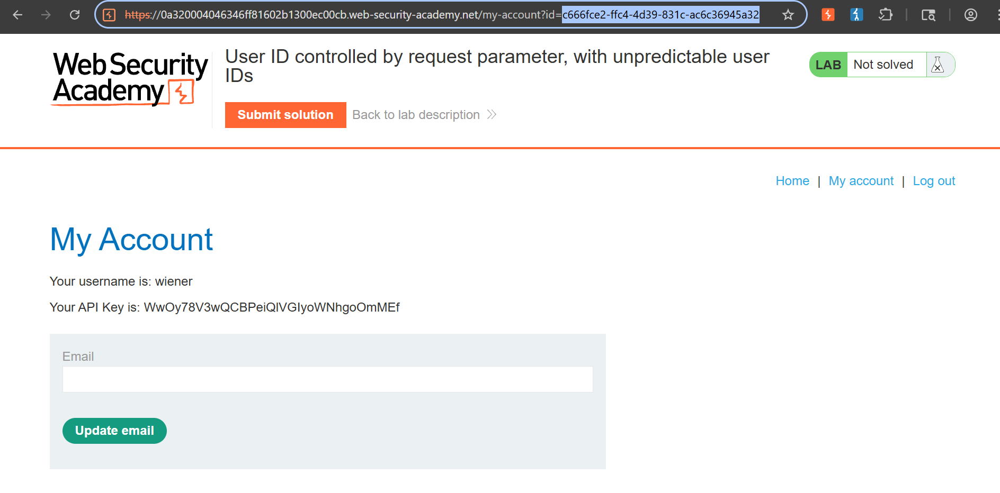
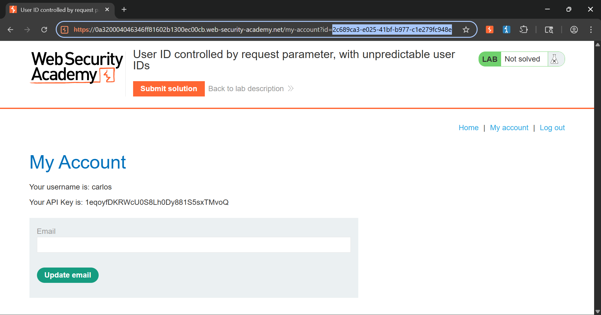

# Lab: User ID Controlled by Request Parameter, with Unpredictable User IDs

## 📌 Vulnerability Profile

* **Vulnerability Type:** Insecure Direct Object Reference (IDOR) / Information Disclosure
* **Severity:** High
* **Flaw:** The application relies entirely on the complexity and randomness of Globally Unique Identifiers (UUIDs) as its sole layer of defense. While the identifiers cannot be guessed or brute-forced, the application backend fails to validate session ownership when processing the parameter, and it exposes these secret tokens within public areas of the application.

---

## 🕵️ Reconnaissance & Information Gathering

1. Browsed the application's homepage and systematically checked the public blog posts to discover user interaction points.
2. Located a post containing a comment submitted by the target user, `carlos`.
3. Inspected the hyperlink bound to Carlos's username profile card and successfully extracted his non-sequential, random user ID string directly from the routing query:

```
/blogs?userId=2c689ca3-e025-41bf-b977-c1e279fc948e
```

---

## 🛠️ Exploitation & Execution Flow

### Step 1: Target Token Substitution
* Authenticated to the application using standard user test credentials (`wiener:peter`).
* Navigated to the primary user profile space to expose the active parameter scheme layout:
  * *Original URL:* `https://[lab-id].web-security-academy.net/my-account?id=c666fce2-ffc4-4d39-831c-ac6c36945a32`
* Swapped out the personal account ID parameter string via the client browser location bar, embedding Carlos's leaked UUID value instead.

### Step 2: Account Takeover & Data Extraction
* Executed the modified GET request directly inside the browser URL box.
* The system backend handled the request blindly without mapping the target parameter against the active session token, rendering Carlos's private dashboard.
* Located and captured the target user's secret API configuration key from the page body layout.

---

## 📸 Proof of Concept (PoC)

### Leaked Resource Identifier Map:


### Unauthorized Account Takeover:


---

## 💡 Live Hunting Key Takeaway

Security through obscurity is an architectural anti-pattern. Never assume an endpoint or resource is protected simply because its reference key uses a long, random UUID format. Look for companion features—such as forum comment boards, public profile directory links, or chat metadata APIs—where the system inevitably leaks the target identifier string to anonymous clients.