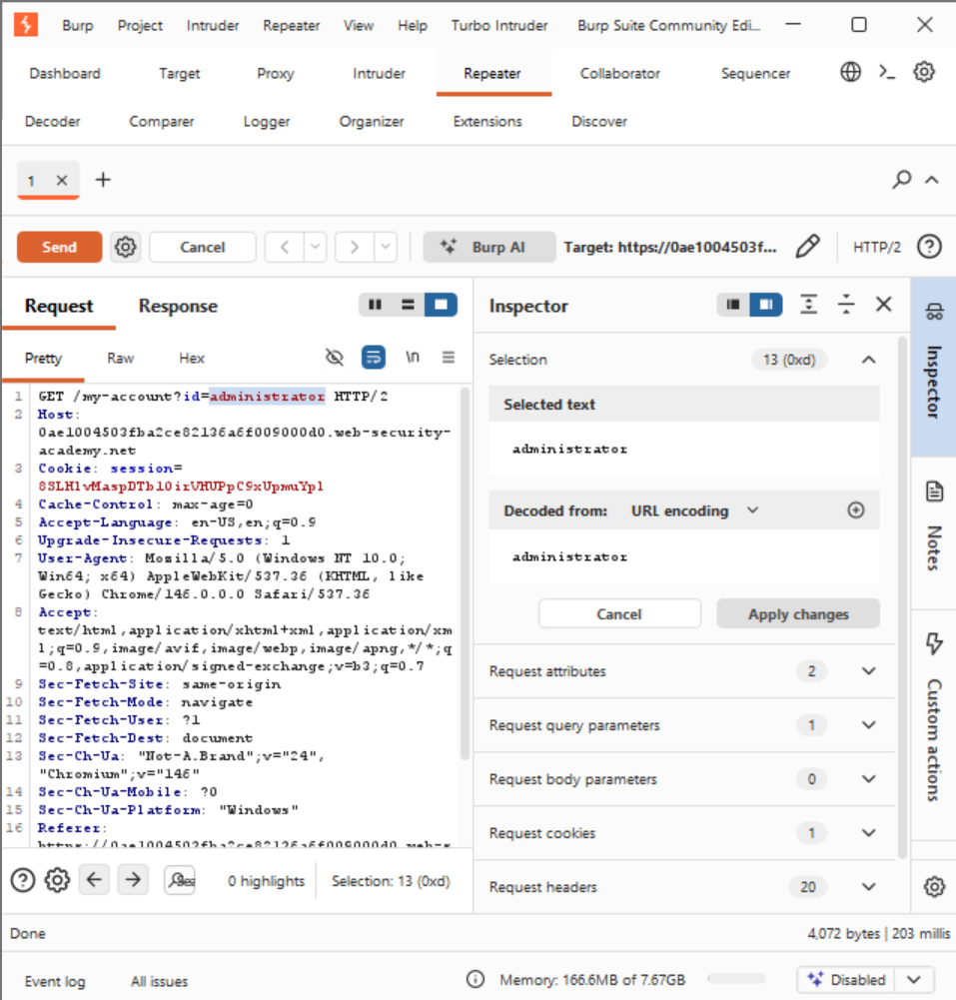
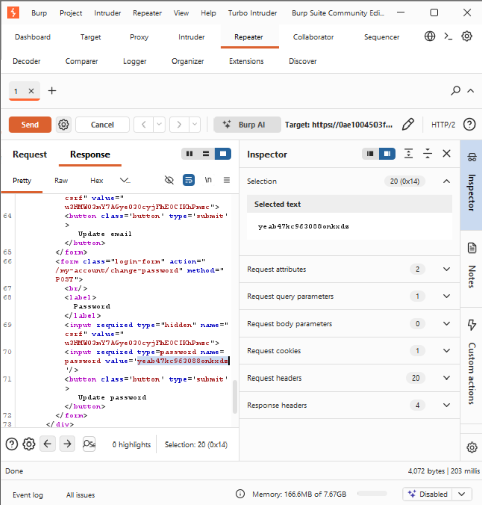
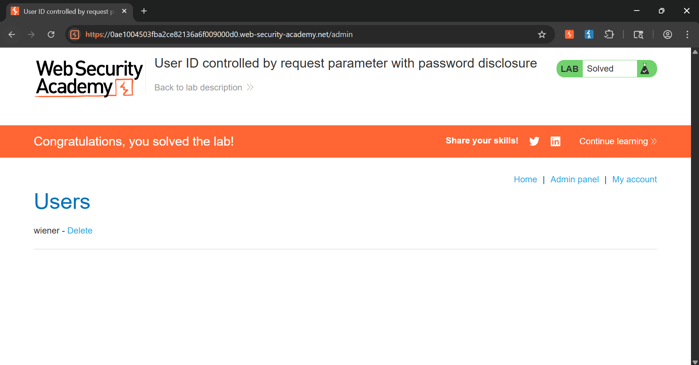

# Lab: User ID Controlled by Request Parameter with Password Disclosure

## 📌 Vulnerability Profile
* **Vulnerability Type:** Insecure Direct Object Reference (IDOR) / Information Disclosure leading to Privilege Escalation
* **Severity:** High
* **Flaw:** The application exposes a mutable parameter (`id`) to handle user account context routing but fails to validate if the client session actually owns the requested resource ID. Compounding this, the backend processes dashboard data requests by pre-populating hidden/visible raw cleartext user account passwords directly into the value attributes of the response HTML DOM layout.

---

## 🕵️ Reconnaissance & Analysis
1. Authenticated to the application utilizing standard non-privileged tester credentials (`wiener:peter`).
2. Navigated to the personal account settings page and monitored the traffic baseline inside Burp Suite.
3. Noticed an explicit direct identifier parameter embedded directly in the routing path inside Burp Suite Repeater:
   
   GET /my-account?id=wiener HTTP/2

---

## 🛠️ Exploitation & Execution Flow

### Primary Vector: Automated Interception & Parameter Overriding (Via Burp Suite)

### Step 1: Modifying the Target Object Identifier
* Caught the standard account page loading request stream and forwarded the packet to Burp Suite Repeater.
* Swapped out the standard `id=wiener` identifier value in the query line to point directly to the core infrastructure account entity string:
  
  GET /my-account?id=administrator HTTP/2

### Step 2: Cleartext Credential Extraction from Response DOM
* Dispatched the tampered request buffer to the server backend.
* Analyzed the returning server payload body inside Burp Suite Repeater. Discovered that the application rendered the administrative profile's password modification form block.
* Successfully extracted the cleartext administrative account credential value parameter directly out of the raw HTML source string:
  
  <input required type="password" name="password" value='yeab47kc963088onkxds' />

### Step 3: Administrative Session Takeover & Domain Clearance
* Logged out of the initial dummy tester profile (`wiener`) and fully authenticated back into the portal interface using the cracked credential variables:
  
  administrator:yeab47kc963088onkxds

* Accessed the unmasked administrative management panel link exposed in the header navigation menu.
* Triggered the deletion execution macro targeting user profile account `carlos` to officially satisfy the lab compliance parameters.

---

## 🔄 Alternative Exploitation Vector (Via Client Browser Only)
Because the system tracks object mapping states entirely via a clean `GET` string embedded directly inside the browser URL box, an alternative exploitation execution loop can bypass proxy tools entirely:

1. Log into your test account window and navigate directly to the browser location address bar.
2. Manually alter the URL query string from `?id=wiener` to `?id=administrator` and hit Enter.
3. Once the administrator account profile loads, press `Ctrl + U` (or right-click the password text entry field box and select Inspect) to expose the developer tools panel.
4. Scan the input elements to read the pre-filled `value="..."` string tag showing the admin password, then follow standard login steps to drop Carlos.

---

## 📸 Proof of Concept (PoC)

### 1. Burp Interception & Object Manipulation:
* Manipulating the `id` request variable within Burp Suite Repeater to target administrative parameters:

### 2. Cleartext Password Data Disclosure:
* Inspecting the raw HTTP response body to parse out the pre-populated plain-text credential token:

### 3. Full Domain Escalation & Target Clearance:
* Validating administrative login access and triggering target database deletion to clear the objective parameters:
